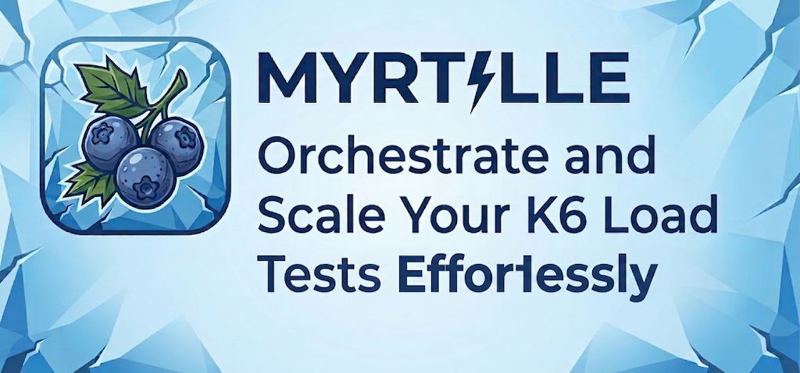

# myrtille

`myrtille` orchestrates [k6](https://k6.io) load tests in three phases:

1. **init** — brings the tested service into a known state (creating data via declarative HTTP
   calls) and builds a state dictionary.
2. **run** — launches the k6 scenario, passing it this state dictionary. With the custom k6 binary
   described in [Live dashboard](docs/live-dashboard.md), k6's own live web dashboard is served for
   the duration of the run, and — if `service.metrics.url` is configured — the service's own
   `/metrics` endpoint (Prometheus format) is mirrored into it too, alongside k6's own metrics,
   updating in real time.
3. **report** — writes a Markdown and/or JSON summary once the run finishes: the init/teardown step
   tables, and the k6 results (thresholds, percentiles, per-check pass/fail counts, etc.).

A single generic CLI binary (`myrtille`), driven by a per-project YAML config file — no Go code
to write on the consuming project's side.

## Requirements

- Go 1.27+
- The [`k6`](https://k6.io/docs/get-started/installation/) binary must be on the `PATH` — unless
  you're using a release tarball (see "Installation"), which already bundles the custom k6 binary
  the live dashboard needs (see [Live dashboard](docs/live-dashboard.md)).

## Installation

```sh
go install github.com/thecoons/myrtille/cmd/myrtille@latest
```

Or locally:

```sh
go build -o bin/myrtille ./cmd/myrtille
```

Or download a prebuilt Linux binary (amd64/arm64) from the
[releases page](https://github.com/thecoons/myrtille/releases) — the tarball bundles `myrtille`
alongside the custom k6 binary the live dashboard needs, so extracting it is enough:

```sh
tar -xzf myrtille-vX.Y.Z-linux-amd64.tar.gz
cd myrtille-vX.Y.Z-linux-amd64
./myrtille run --config myrtille.yaml   # live dashboard works immediately, no setup
```

To install system-wide, move both binaries together — `myrtille` looks for a `k6` sitting right
next to itself (see [Live dashboard](docs/live-dashboard.md)) — or just `myrtille` alone if you
don't want the live dashboard, or already manage k6 separately:

```sh
sudo mv myrtille-vX.Y.Z-linux-amd64/{myrtille,k6} /usr/local/bin/
```

## Usage

```sh
myrtille run --config myrtille.yaml
myrtille init --config myrtille.yaml   # runs only the init phase, for debugging
myrtille teardown --config myrtille.yaml --state-file /tmp/myrtille-state-XXXX.json
```

The exit code of `myrtille run` mirrors k6's (0 = success, 99 = failed thresholds, other = script
error). The report is always written, even if the init phase or the thresholds fail.

`myrtille run` always attempts `teardown.steps` (see the [config reference](docs/config-reference.md))
before returning, even if init or k6 failed partway — so if `teardown.steps` is configured, it
prints the state file's path to stderr first: `state file: /tmp/myrtille-state-XXXX.json`. That
path is only useful for recovery — if the process is killed hard enough (`kill -9`) to skip its own
cleanup, rerun it standalone with `myrtille teardown --state-file <that path>`.

k6's own ASCII banner and per-second progress lines are suppressed by default (`--quiet`) — they
add up fast in `--suite`, where they'd otherwise repeat once per scenario. The final summary (checks,
custom metrics, thresholds) still prints in full; only the noise in between is gone. This only
applies without the live dashboard: k6 gates the one line that prints the dashboard's URL behind
the same flag, so myrtille skips `--quiet` whenever the dashboard is active. Add
`k6.args: ["--quiet=false"]` to a scenario's config to opt back into the verbose output.

## Documentation

- **[Config reference](docs/config-reference.md)** — every `myrtille.yaml` field: init/teardown
  steps, derived state, declarative k6 scenarios, `k6.setup`, custom `k6.script`, `.env`/`vars`.
- **[Live dashboard](docs/live-dashboard.md)** — k6's live web dashboard, mirroring the service's
  own Prometheus metrics and OpenTelemetry spans into it, exporting it to `report.html`.
- **[Advanced usage](docs/advanced-usage.md)** — myrtille managing the service's own start/stop,
  running a suite of scenarios, loading a preloaded state file.

## Full example

See [`examples/demo-service`](examples/demo-service): a minimal HTTP service (`stubservice`) and a
`myrtille.yaml` config exercising it end-to-end (init steps + declarative `k6.steps`, no
hand-written script), forming a complete smoke test. The demo config also sets
`service.metrics.url` and `report.formats: [..., "dashboard-html"]`, so it doubles as a live and
exported-dashboard demo — and `service.managed`, so `myrtille run` starts/stops `stubservice`
itself (see [Advanced usage](docs/advanced-usage.md)); only building it is left to you.

```sh
go build -o /tmp/stubservice ./examples/demo-service/stubservice

go build -o bin/myrtille ./cmd/myrtille

go install go.k6.io/xk6/cmd/xk6@latest
export PATH="$PATH:$(go env GOPATH)/bin"
./scripts/build-k6.sh   # builds bin/k6, right next to bin/myrtille — auto-detected, no config needed

bin/myrtille run --config examples/demo-service/myrtille.yaml
```

Watch for `web dashboard: http://127.0.0.1:XXXXX` in the output and open it while the run is in
progress (10s by default) — k6's own metrics show up immediately, and the "Service" tab's counters
(fed from `stubservice`'s own `/metrics`) appear a couple of seconds in, once there's a second
scrape to compute a delta from.

The report is written to `examples/demo-service/reports/<timestamp>/`: `report.md`, `report.json`,
and — thanks to `"dashboard-html"` — `report.html`, the same dashboard frozen at the end of the run,
open it straight from disk once the run is done, no server needed.

## License

MIT — see [LICENSE](LICENSE).
