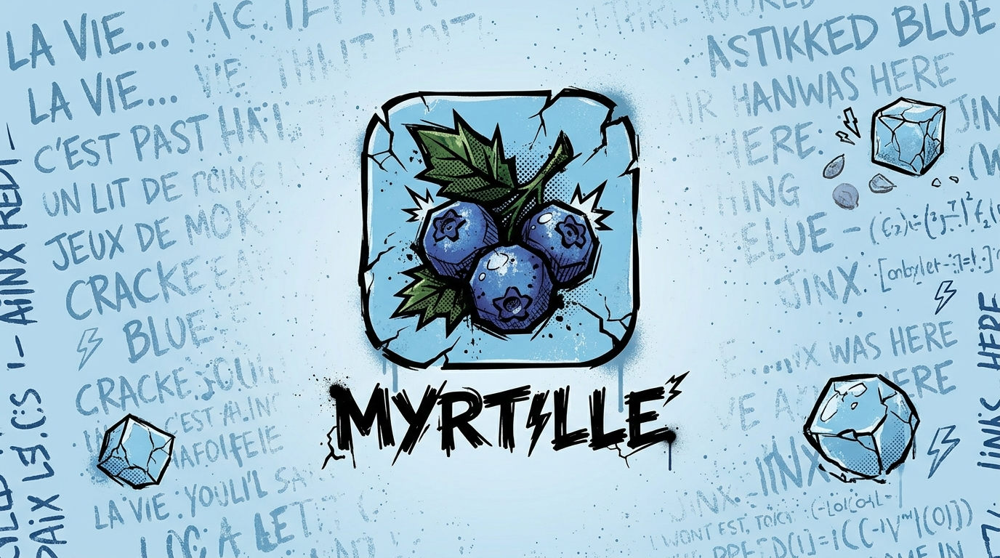

# myrtille

`myrtille` orchestrates [k6](https://k6.io) load tests in three phases:

1. **init** — brings the tested service into a known state (creating data via declarative HTTP
   calls) and builds a state dictionary.
2. **run** — launches the k6 scenario, passing it this state dictionary. With the custom k6 binary
   described in "Live dashboard" below, k6's own live web dashboard is served for the duration of
   the run, and — if `service.metrics.url` is configured — the service's own `/metrics` endpoint
   (Prometheus format) is mirrored into it too, alongside k6's own metrics, updating in real time.
3. **report** — writes a Markdown and/or JSON summary once the run finishes: the init/teardown step
   tables, and the k6 results (thresholds, percentiles, per-check pass/fail counts, etc.).

A single generic CLI binary (`myrtille`), driven by a per-project YAML config file — no Go code
to write on the consuming project's side.

## Requirements

- Go 1.27+
- The [`k6`](https://k6.io/docs/get-started/installation/) binary must be on the `PATH` — unless
  you're using a release tarball (see "Installation"), which already bundles the custom k6 binary
  the live dashboard needs (see "Live dashboard" below).

## Installation

```sh
go install github.com/thecoons/myrtille/cmd/myrtille@latest
```

Or locally:

```sh
go build -o bin/myrtille ./cmd/myrtille
```

Or download a prebuilt Linux binary (amd64/arm64) from the
[releases page](https://github.com/thecoons/myrtille/releases) — the tarball bundles `myrtille`
alongside the custom k6 binary the live dashboard needs, so extracting it is enough:

```sh
tar -xzf myrtille-vX.Y.Z-linux-amd64.tar.gz
cd myrtille-vX.Y.Z-linux-amd64
./myrtille run --config myrtille.yaml   # live dashboard works immediately, no setup
```

To install system-wide, move both binaries together — `myrtille` looks for a `k6` sitting right
next to itself (see "Live dashboard" below) — or just `myrtille` alone if you don't want the live
dashboard, or already manage k6 separately:

```sh
sudo mv myrtille-vX.Y.Z-linux-amd64/{myrtille,k6} /usr/local/bin/
```

## Usage

```sh
myrtille run --config myrtille.yaml
myrtille init --config myrtille.yaml   # runs only the init phase, for debugging
myrtille teardown --config myrtille.yaml --state-file /tmp/myrtille-state-XXXX.json
```

The exit code of `myrtille run` mirrors k6's (0 = success, 99 = failed thresholds, other = script
error). The report is always written, even if the init phase or the thresholds fail.

`myrtille run` always attempts `teardown.steps` (see below) before returning, even if init or k6
failed partway — so if `teardown.steps` is configured, it prints the state file's path to stderr
first: `state file: /tmp/myrtille-state-XXXX.json`. That path is only useful for recovery — if the
process is killed hard enough (`kill -9`) to skip its own cleanup, rerun it standalone with
`myrtille teardown --state-file <that path>`.

## Live dashboard

k6 ships its own live web dashboard (VUs, request rate, latencies, thresholds, and any custom
metric). myrtille can additionally mirror the tested service's own `/metrics` endpoint into the
same dashboard, in its own "Service" tab, updating in real time next to k6's own metrics.

This needs a custom k6 binary — stock k6 doesn't have the extension that does the mirroring.
`myrtille` looks for one in this order: `$MYRTILLE_K6_BIN` if set, then a `k6` sitting in the same
directory as the running `myrtille` binary itself, then falls back to plain `k6` on the `PATH`
(stock, no live dashboard).

**Using a release tarball** (see "Installation" above): already covered, nothing to do — the
bundled `k6` sits right next to `myrtille`, so the second resolution step finds it automatically.
`myrtille` prints `k6 binary: ... (bundled next to myrtille)` to stderr whenever this kicks in, so
it's clear which binary is running.

**Using `go install` or a local build**: no bundled binary to find, so build the custom one once
and point myrtille at it explicitly:

```sh
go install go.k6.io/xk6/cmd/xk6@latest
export PATH="$PATH:$(go env GOPATH)/bin"
./scripts/build-k6.sh   # builds bin/k6

MYRTILLE_K6_BIN="$(pwd)/bin/k6" myrtille run --config myrtille.yaml
```

(If `myrtille` and `bin/k6` happen to live in the same directory — e.g. after
`go build -o bin/myrtille` — the co-located lookup finds it too, `MYRTILLE_K6_BIN` isn't even
required; setting it explicitly always takes priority regardless.)

k6 prints the dashboard's URL to stdout on its own (`web dashboard: http://127.0.0.1:XXXXX`) — open
it in a browser while the run is in progress; myrtille doesn't launch a browser for you. With none
of the three resolution steps finding a custom binary, nothing changes: no live dashboard, stock k6
behavior exactly as before.

With `k6.steps`, a configured `service.metrics.url` (see "Config" below) is wired into the
dashboard automatically — every distinct metric family found on that endpoint gets its own chart in
the "Service" tab. With a hand-written `k6.script`, wire it in yourself — see "Custom k6 scripts"
below.

### Exporting the dashboard to `report.html`

Adding `"dashboard-html"` to `report.formats` (see "Config" below) saves k6/xk6-dashboard's own
standalone export — the same dashboard, self-contained (no network access needed to view it), as
`report.html` next to `report.md`/`report.json` in the report directory. This still requires the
custom k6 binary above; requesting it without one fails the run with a clear error rather than
silently producing a report without the file.

### Loading a preloaded state file (`myrtille run --state-file`)

`init.steps` is a declarative template/count/extract mini-language — it can't express seeding logic
that's too dynamic (e.g. a recursive generator with per-level arithmetic, or nested CIDR
computation from a parent). For that case, seed the state dict entirely outside myrtille (any tool,
any language) and load it directly, skipping `init.steps`:

```sh
myrtille run --config myrtille.yaml --state-file /path/to/preloaded-state.json
```

The file must be the same flat JSON object shape `myrtille init`/`state.Dict` produces
(`{"key": [...]}`). `--state-file` is mutually exclusive with both `init.steps` and `init.command`
(below) — configuring more than one is a hard error. k6 receives the loaded dict exactly as it
would init.steps' output (same `k6.state_env` variable); the report's "Init Phase" section stays
empty (`init: null` in JSON) since no init phase ran.

### Running an external setup script (`init.command`)

`--state-file` above still needs an external wrapper (a `run.sh` or CI step) to sequence "seed,
then `myrtille run`". `init.command` instead lets `myrtille run` be the only entry point: it runs a
shell command line (via `sh -c`), inheriting the parent process's environment exactly like
`k6.script` — no templating needed, ordinary env vars (`BASE_URL`, etc.) just work. stdout/stderr
are streamed through myrtille's own, for visibility during a long seed.

```yaml
init:
  command: ./seed.sh
  command_timeout: 5m   # optional, this is the default
```

The command must write a state.Dict-shaped JSON object (same shape as `--state-file`) to the path
given via the `MYRTILLE_STATE_OUTPUT` env var before exiting `0`:

```sh
#!/bin/sh
echo '{"user_ids": ["u1", "u2"]}' > "$MYRTILLE_STATE_OUTPUT"
```

A non-zero exit or exceeding `command_timeout` fails the run, same as an `init.steps` HTTP failure.
`init.command` is mutually exclusive with both `init.steps` and `--state-file`. The report's "Init
Phase" section shows the command, its exit code, and its duration instead of a step table.

## Config (`myrtille.yaml`)

```yaml
name: my-service-load-test
ref: "JIRA-PROJ-45"          # optional, informational, shown in the report

# Project-level constants, available in every step's url/body/count
# templates via `.Vars`.
vars:
  user_count: 20
  max_orders_per_user: 3

service:
  base_url: http://localhost:8080
  metrics:
    url: http://localhost:8080/metrics   # optional — powers the live dashboard's "Service" tab,
    interval: 5s                          # see "Live dashboard" above; no effect without a custom k6 binary

init:
  steps:
    # list_products runs first so product_ids is already in the dictionary
    # by the time create_users (and its children) run.
    - name: list_products
      method: GET
      url: "{{.BaseURL}}/products"
      extract:
        - path: "#.id"         # gjson syntax to extract a field from each element of an array
          as: "product_ids"
    - name: create_users
      method: POST
      url: "{{.BaseURL}}/users"
      body: '{"name": "user-{{.Index}}"}'
      count: "{{.Vars.user_count}}"   # literal ("20") or template expression; {{.Index}} available (0-based)
      extract:
        - path: "id"           # gjson syntax applied to the JSON response
          as: "user_ids"       # accumulated into an array in the state dictionary
      # children: run once per parent iteration, with that iteration's JSON
      # response exposed as `.Parent` — for creating dependent resources
      # rather than only independent pools.
      children:
        - name: create_orders_for_user
          method: POST
          url: "{{.BaseURL}}/orders"
          body: '{"userId":"{{.Parent.id}}","productId":"{{pick .Dict.product_ids}}"}'
          count: "{{random 1 .Vars.max_orders_per_user}}"   # 1 to 3 orders per user

k6:
  # Declarative scenario: myrtille generates the k6 script for you (see
  # "Declarative k6 scenario steps" below). Alternative: `script: ./scenario.js`
  # for a hand-written script — mutually exclusive with `steps`/`options`.
  steps:
    - name: place_order
      method: POST
      url: "{{.BaseURL}}/orders"
      body: '{"userId":"{{pick "user_ids"}}","productId":"{{pick "product_ids"}}"}'
      checks:
        "status is 201": "r.status === 201"
      sleep: 200ms
  options:
    vus: 10
    duration: 30s
    thresholds:
      http_req_failed: ["rate<0.01"]
  state_env: STATE_FILE        # name of the env var exposing the state JSON's path

report:
  output_dir: ./reports
  formats: ["markdown", "json"]  # "dashboard-html" also available — see "Live dashboard" above
```

Each init step: the request is aborted (and the k6 run cancelled) on the first HTTP failure
(status >= 400) or any extraction error — a partially initialized service would make the
subsequent load test unreliable.

`count` is a Go template (`text/template`), resolved once before iterating the step, with access
to:
- `.Vars` — the project's `vars` block;
- `.Parent` — the parsed JSON response of the parent iteration, `nil` for a root step;
- `.Dict` — a read-only snapshot of the values extracted so far (for picking from an existing pool);

and two functions: `random min max` (an inclusive random integer) and `pick list` (a random
element from a list, typically `.Dict.my_pool`). These same variables/functions are also
available in the `url` and `body` templates. Steps can be nested to any depth via `children`;
reports render the resulting tree as an indented list (`↳`).

### Cleaning up (`teardown.steps`)

`teardown.steps` uses the exact same shape as `init.steps`, run after k6 to remove whatever
`init.steps` created. Go's `text/template` ships `index`/`len` as builtins, so no new syntax is
needed to target exactly what got created — just walk `.Dict` by position:

```yaml
teardown:
  steps:
    - name: delete_users
      method: DELETE
      url: "{{.BaseURL}}/users/{{index .Dict.user_ids .Index}}"
      count: "{{len .Dict.user_ids}}"
```

Unlike `init.steps`, teardown never aborts on a failure (e.g. deleting something already gone) —
it's best-effort by nature, so one failed request doesn't stop the rest of the cleanup. It runs
automatically at the end of every `myrtille run`, on every exit path (success, a failed init, a
failed k6 run) — teardown failures are reported separately (see `myrtille run`'s report) rather
than failing the run itself.

### Declarative k6 scenario steps

For a scenario that's just "hit these endpoints, pick from an extracted pool, sleep a bit",
`k6.steps` generates the k6 script for you — no `scenario.js` to write. It's mutually exclusive
with `k6.script`:

```yaml
k6:
  steps:
    - name: place_order
      method: POST
      url: "{{.BaseURL}}/orders"
      body: '{"userId":"{{pick "user_ids"}}","productId":"{{pick "product_ids"}}"}'
      checks:
        "status is 201": "r.status === 201"   # `r` is the k6 response, as in check(res, {...})
      sleep: 200ms
  options:
    vus: 10
    duration: 30s
    thresholds:
      http_req_failed: ["rate<0.01"]
```

Steps run once each, in declaration order, per k6 iteration — the repetition axis here is
`k6.options` (`vus`/`duration`/`iterations`/`stages`), not a per-step count. `pick`/`random`
mirror the init-phase functions by name, but resolve differently: since k6, not myrtille, drives
a scenario's iteration loop, they can't be evaluated once at generation time — instead they
expand to small JS snippets that the generated script evaluates itself, fresh on every k6
iteration. The generated script is an ephemeral temp file, removed once the run finishes.
`headers` (a map, like `init.steps`) is also supported per step.

A third function, `uniqueId`, expands to a value guaranteed unique per k6 iteration (`` ${__VU}-
${__ITER}-${Date.now()} ``, or `` ${'setup'}-${0}-${Date.now()} `` inside `k6.setup`, where
`__VU`/`__ITER` aren't defined) — for resource names that must not collide, e.g. `body:
'{"name":"write-{{uniqueId}}"}'`.

`pick` also takes an optional second argument — a field name — to draw a **correlated** value out
of a pool of objects rather than a scalar: `{{pick "perimeter_keys" "domain"}}` and
`{{pick "perimeter_keys" "name"}}` used together in the same step reference the *same* randomly-
chosen element (verified against a real k6 run: paired fields always come from one consistent
element, never mixed across two independent draws), whereas plain `{{pick "pool"}}` calls stay
independent draws, exactly as before. Such an object pool comes from extracting a whole JSON
object per iteration into the same key — e.g. an `init.steps` `extract` with `path: "@this"` —
rather than a single scalar field.

`tags` (a map, values are templates like `url`/`body`) is passed straight through to the
generated `http.request(..., { tags: {...} })` call, so a step's request metrics can be segmented
by logical variant of the same scenario — e.g. distinguishing two endpoints hit by the same script,
or a `live` vs `revision` selector — the same way a hand-written `k6.script` would tag requests
itself:

```yaml
k6:
  steps:
    - name: get_perimeter
      method: GET
      url: "{{.BaseURL}}/perimeter"
      tags:
        endpoint: get
  options:
    thresholds:
      "http_req_duration{endpoint:get}": ["p(95)<300"]
```

`repeat` (a Go template, like `init.steps`' `count` — resolved once at generation time against
`.BaseURL`/`.Vars`, not at k6 runtime like `pick`/`random`) wraps the step's request in a JS `for`
loop, running it that many times per k6 iteration — for an action that must repeat before the next
step (e.g. touching N perimeters before creating a revision). Omitting it runs the step once, as
before:

```yaml
k6:
  steps:
    - name: touch_perimeter
      method: PATCH
      url: "{{.BaseURL}}/perimeters"
      repeat: "{{.Vars.perimeters_per_version}}"
```

### Running something once (`k6.setup`)

`k6.steps` alone has no way to run an HTTP call once for the whole test rather than on every
iteration — e.g. creating a shared resource once, then having every iteration reference it.
`k6.setup` generates a k6 [`setup()`](https://grafana.com/docs/k6/latest/using-k6/test-lifecycle/)
for you, same declarative shape as `init.steps` (with `extract`), run once before any `k6.steps`
iteration:

```yaml
k6:
  setup:
    - name: create_revision
      method: POST
      url: "{{.BaseURL}}/revisions"
      body: '{"name":"bench-{{uniqueId}}"}'
      extract:
        - path: name
          as: version_name
  steps:
    - name: list_by_revision
      url: '{{.BaseURL}}/revisions/{{pick "version_name"}}/items'
```

Extracted values are merged into the same pool `pick`/`random` read from in the regular steps
below — verified with `--http-debug=full` against a real k6 run: the setup call fires exactly once
(on k6's own dedicated setup VU), and every regular-step VU, including ones that never ran setup
themselves, correctly receives the extracted value (k6 runs each VU as a separate isolate; setup's
result reaches them via its return value, not shared memory).

`extract`'s `path` here is a plain dot-separated JS property/array-index path (e.g. `name`,
`items.0.id`) — a deliberately simpler subset of `init.steps`' gjson syntax, with no `#.field`
flatten-map. `k6.setup` steps have no `tags`/`checks`/`sleep`/`repeat` (not meaningful for a
run-once bootstrap call) and are mutually exclusive with `k6.script` — with a hand-written script,
write `setup()` yourself.

Every named check's pass/fail counts (across the whole run, including any declared via a custom
`k6.script`) are read from k6's `--summary-export` output and shown in the report under "Checks" —
a bullet list in Markdown, and `k6.Summary.Checks` in JSON.

### Custom k6 scripts (`k6.script`)

For a scenario `k6.steps` can't express (custom checks beyond a boolean expression, non-HTTP
protocols, multiple scenarios, etc.), point `k6.script` at a hand-written script instead —
mutually exclusive with `k6.steps`/`k6.options`, which then belong in the script itself. The state
dictionary is serialized to JSON and its path passed to the k6 subprocess via the environment
variable defined by `k6.state_env` (`STATE_FILE` by default). Standard pattern on the script side:

```js
const state = JSON.parse(open(__ENV.STATE_FILE));
const userId = state.user_ids[Math.floor(Math.random() * state.user_ids.length)];
```

With `k6.steps`, a configured `service.metrics.url` automatically wires up live scraping of that
endpoint into k6's dashboard (see "Live dashboard" above) — myrtille generates the two lines
needed. With `k6.script`, myrtille never rewrites a hand-written script, so add them yourself:

```js
import promscrape from 'k6/x/promscrape';

const scraper = new promscrape.Scraper('http://localhost:8080/metrics'); // module scope, not inside a function

export function setup() {
  scraper.start(5000); // interval in ms — match service.metrics.interval
}
```

`k6/x/promscrape` only exists in the custom k6 binary described in "Live dashboard" above —
already found automatically with a release tarball, otherwise set `MYRTILLE_K6_BIN` to point
myrtille at it.

## Full example

See [`examples/demo-service`](examples/demo-service): a minimal HTTP service (`stubservice`) and a
`myrtille.yaml` config exercising it end-to-end (init steps + declarative `k6.steps`, no
hand-written script), forming a complete smoke test. The demo config also sets
`service.metrics.url` and `report.formats: [..., "dashboard-html"]`, so it doubles as a live and
exported-dashboard demo.

```sh
go build -o /tmp/stubservice ./examples/demo-service/stubservice
/tmp/stubservice &

go build -o bin/myrtille ./cmd/myrtille

go install go.k6.io/xk6/cmd/xk6@latest
export PATH="$PATH:$(go env GOPATH)/bin"
./scripts/build-k6.sh   # builds bin/k6, right next to bin/myrtille — auto-detected, no config needed

bin/myrtille run --config examples/demo-service/myrtille.yaml
```

Watch for `web dashboard: http://127.0.0.1:XXXXX` in the output and open it while the run is in
progress (10s by default) — k6's own metrics show up immediately, and the "Service" tab's counters
(fed from `stubservice`'s own `/metrics`) appear a couple of seconds in, once there's a second
scrape to compute a delta from.

The report is written to `examples/demo-service/reports/<timestamp>/`: `report.md`, `report.json`,
and — thanks to `"dashboard-html"` — `report.html`, the same dashboard frozen at the end of the run,
open it straight from disk once the run is done, no server needed.

## License

MIT — see [LICENSE](LICENSE).
